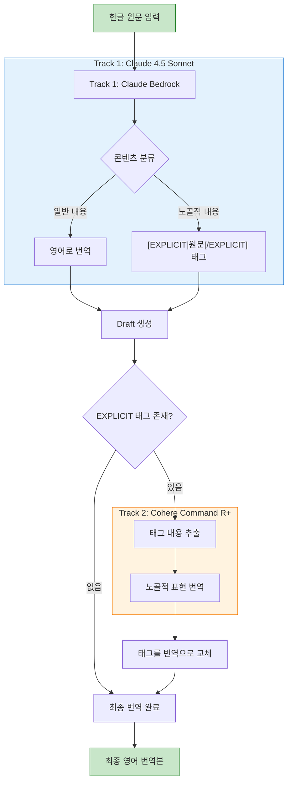

# Korean Adult Novel Translator

19세 이상 한글 성인소설을 영어로 번역하는 투트랙 번역 시스템

## 개요

이 애플리케이션은 AWS Bedrock을 활용한 투트랙 번역 아키텍처를 사용합니다:

- **Track 1 (Claude)**: 일반 콘텐츠 번역 + 노골적 표현 태깅
- **Track 2 (Cohere Command R+)**: 태그된 노골적 표현 번역

Claude는 노골적인 성적 콘텐츠 생성을 제한하므로, 해당 부분은 태그로 표시하고 원문을 유지한 뒤 Cohere Command R+로 번역합니다.

## 아키텍처



## 기능

### 핵심 기능
- **투트랙 번역**: Claude + Cohere Command R+ 조합
- **Cross-Region Inference Profile**: AWS Bedrock 최신 모델 지원

### 추가 기능
- **파일 업로드**: txt, docx 파일 지원
- **배치 번역**: 여러 파일 동시 번역
- **번역 히스토리**: 세션 내 번역 기록 저장 및 내보내기
- **다운로드**: TXT, JSON 형식 지원

## 지원 모델

### Track 1 (Claude Bedrock)
| 모델 | Model ID |
|------|----------|
| Claude 4.5 Sonnet | `us.anthropic.claude-sonnet-4-5-20250929-v1:0` |
| Claude 3.5 Sonnet v2 | `us.anthropic.claude-3-5-sonnet-20241022-v2:0` |
| Claude 3.5 Haiku | `us.anthropic.claude-3-5-haiku-20241022-v1:0` |

### Track 2 (Explicit Content)
| 엔진 | 설명 | 테스트 결과 |
|------|------|:---:|
| Cohere Command R+ (Bedrock) | AWS Bedrock 통합, 추가 API 키 불필요 | 매우 좋음 |
| Ollama (Self-hosted) | 로컬 실행, dolphin-llama3 등 uncensored 모델 | 매우 좋음 |
| OpenRouter | 다양한 모델 접근, API 키 필요 | 좋음 |

## 설치 및 실행

### 1. 의존성 설치

```bash
pip install -r requirements.txt
```

### 2. AWS 자격증명 설정

```bash
aws configure
# AWS Access Key ID, Secret Access Key, Region 입력
```

### 3. Ollama 설치 (선택사항)

```bash
# macOS
brew install ollama
brew services start ollama
ollama pull dolphin-llama3:8b
```

### 4. 앱 실행

```bash
streamlit run app.py
```

브라우저에서 http://localhost:8501 접속

## 프로젝트 구조

```
49.adult_content/
├── app.py                 # 메인 Streamlit 애플리케이션
├── requirements.txt       # Python 의존성
├── .env                   # 환경변수 (비공개)
├── .env.example           # 환경변수 템플릿
├── README.md              # 이 문서
├── backup/                # 소스코드 백업
│   └── app_v1_*.py
└── example/               # 샘플 파일
    ├── sample_input.txt
    └── README.txt
```

## 사용법

### Single Translation
1. 텍스트를 직접 입력하거나 파일 업로드
2. Track 2 엔진 선택 (Cohere Command R+ 권장)
3. Translate 버튼 클릭
4. 결과 확인 및 다운로드

### Batch Translation
1. Batch Translation 탭 선택
2. 여러 파일 업로드
3. Start Batch Translation 클릭
4. 개별 결과 다운로드

### History
1. History 탭에서 이전 번역 확인
2. JSON으로 전체 내보내기 가능

## 테스트 결과

| Track 2 엔진 | 한국어 번역 품질 | 노골적 콘텐츠 처리 | 권장도 |
|-------------|:---:|:---:|:---:|
| Cohere Command R+ (Bedrock) | 우수 | 우수 | ★★★★★ |
| Ollama (dolphin-llama3) | 양호 | 우수 | ★★★★☆ |
| OpenRouter (Mistral) | 양호 | 양호 | ★★★☆☆ |

## 주의사항

- 이 도구는 19세 이상 성인 콘텐츠 번역용입니다
- AWS Bedrock 사용 요금이 발생합니다
- 저작권이 있는 콘텐츠 번역 시 관련 법규를 준수하세요

## 버전 히스토리

### v2.0 (2026-01-17)
- 파일 업로드 기능 추가 (txt, docx)
- 배치 번역 기능 추가
- 번역 히스토리 기능 추가
- Venus AI, KoboldAI 제거 (불안정)
- UI 개선

### v1.0
- 초기 버전
- 투트랙 번역 로직 구현
- Claude Bedrock + Cohere Command R+ 조합
